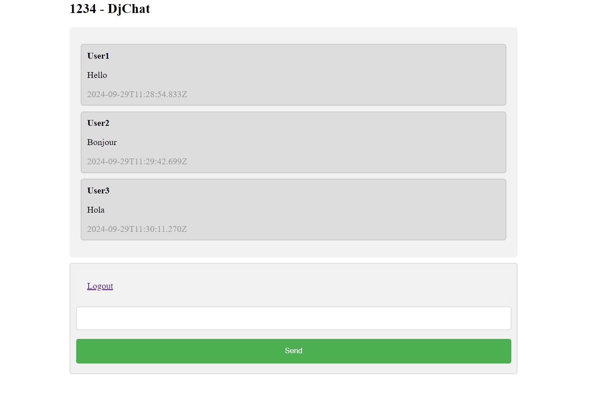

<h1 align="center">Django Project</h1>
<br>



### Run this app locally

```shell
python manage.py runserver
```

### How to Use

- Login using Room Name and Username.
- Login in different tab with same Room Name but different Username.